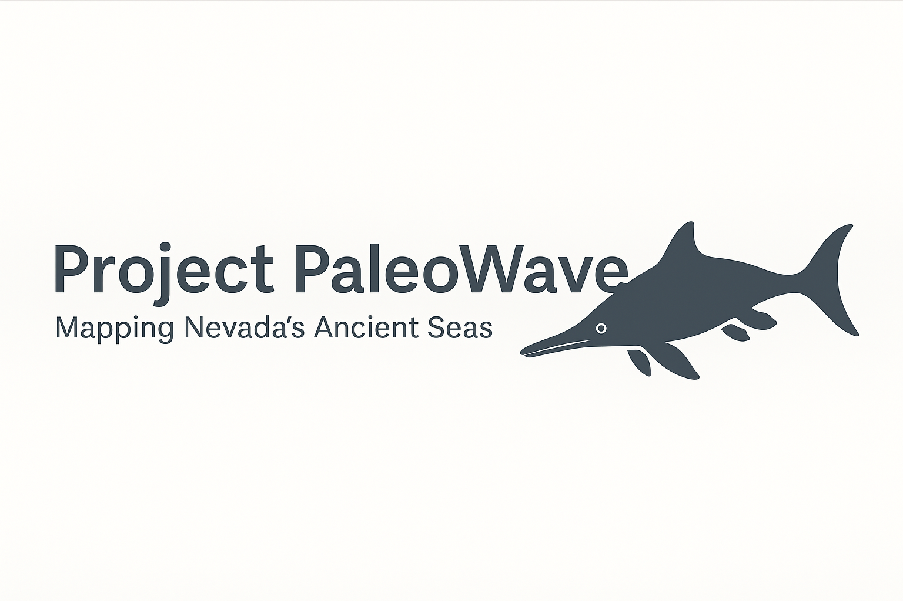
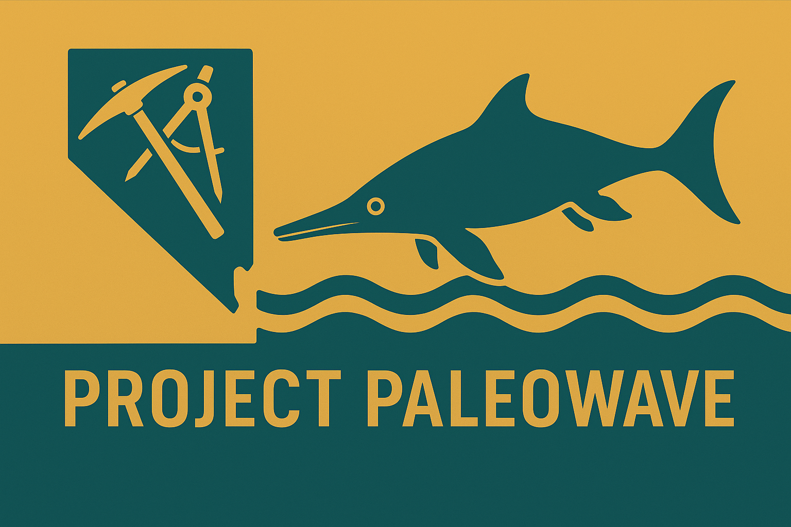

  

# 🦴 Project PaleoWave

**“Mapping Nevada’s Ancient Seas”**

Project PaleoWave is a reproducible geospatial workflow designed to
identify and prioritize potential ichthyosaur fossil localities in
Nevada using open data and modern analytical tools — **R**, **Python**,
**QGIS**, **Pixi**, and the **Paleobiology Database (PBDB)**.

------------------------------------------------------------------------

## 🌵 Inspiration

As a student at the **University of Nevada**, I was captivated by the
ichthyosaur fossils displayed on campus and the vast, fossil-bearing
deserts of central Nevada.\
Back then — in the early 1990s — prospecting for fossils meant paper
maps, long hikes, and plenty of educated guessing. Technology just
wasn’t there yet.

During those years, my friends and I would unwind at [**Great Basin
Brewing Co.](https://www.greatbasinbrewingco.com/about)
 in Reno**, sipping **Ichthyosaur “Icky” IPA** — a tribute to
Nevada’s state fossil and the prehistoric seas that once covered this
region.

That same curiosity (and maybe a few “Ickys”) inspired this project —
but now, with better tools: **LiDAR**, **open fossil data**, and
**machine learning**.

------------------------------------------------------------------------

## ⚙️ Project Overview

**Goal:** Develop a fully reproducible, modular workflow for predicting
ichthyosaur fossil-bearing sites using: - **PBDB fossil occurrence
data**\
- **LiDAR-derived terrain metrics** (slope, ruggedness, exposure) -
**Geological formation filtering** (Triassic marine units) -
**Rule-based and machine learning models** - **QGIS visualization and
field-ready mapping**

The workflow is designed to be: - 🧩 **Modular** — easily adapted to
other fossil taxa or regions\
- 🔁 **Reproducible** — managed through **Pixi** and **renv**
environments\
- 🗺️ **Field-ready** — generating ranked candidate polygons for
exploration

------------------------------------------------------------------------

## 🧪 Tech Stack

-   **Python:** LiDAR processing, machine learning (PDAL, scikit-learn,
    rasterio)
-   **R:** Spatial analysis and visualization (terra, sf, tmap)
-   **QGIS:** Map creation, candidate evaluation
-   **Pixi:** Lightweight environment manager for reproducibility
-   **PBDB:** Open paleontological data source

------------------------------------------------------------------------

## 🚀 Repo Structure

PaleoWave/ ├── data/ ├── scripts/ ├── qgis/ ├── docs/ └──
environment.yml

See the README and scripts for details on how to run each stage.

------------------------------------------------------------------------

## 🏜️ Why It Matters

With these tools, we can reduce the time spent wandering the desert by
focusing on areas where geology, terrain, and known fossil occurrences
all intersect.\
It’s about combining science, curiosity, and a bit of Nevada spirit — to
bring the ichthyosaurs of Berlin back into the light.

So grab a map (and maybe an Icky IPA), and let’s go find some fossils.

## 🚩 Project Flag

  
   
  <em>The official field emblem of Project PaleoWave — inspired by Nevada’s ancient seas.</em>

