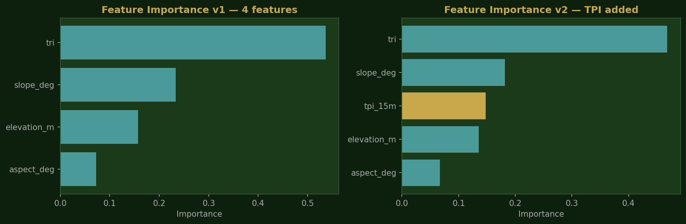
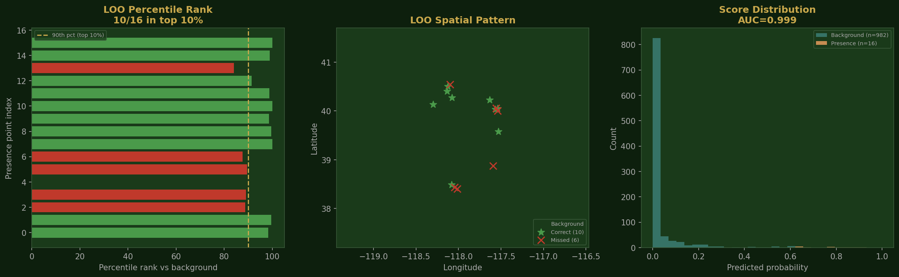
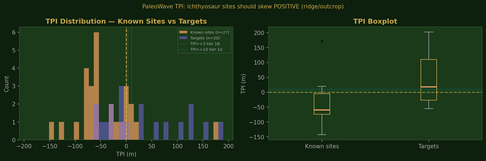
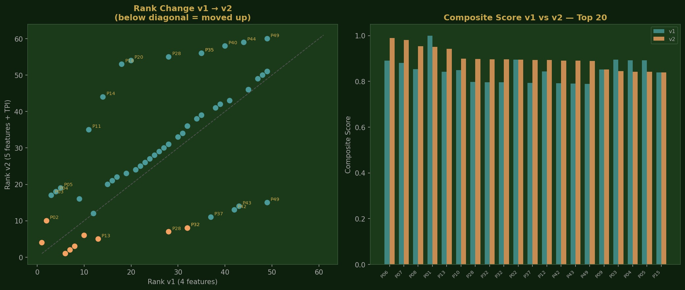
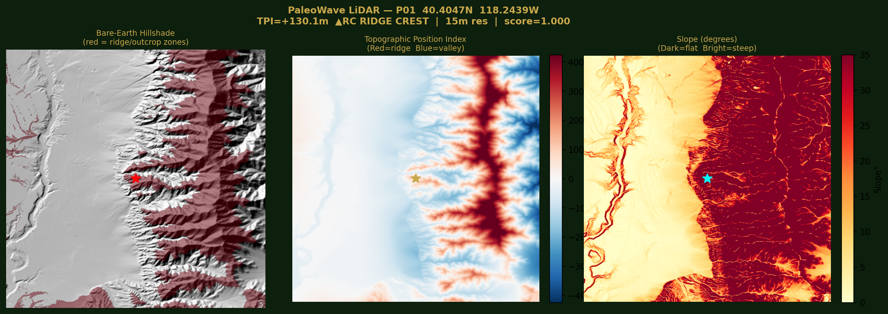
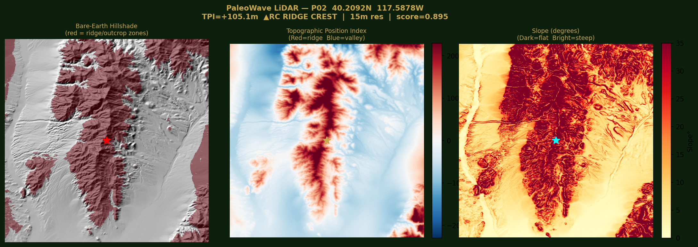
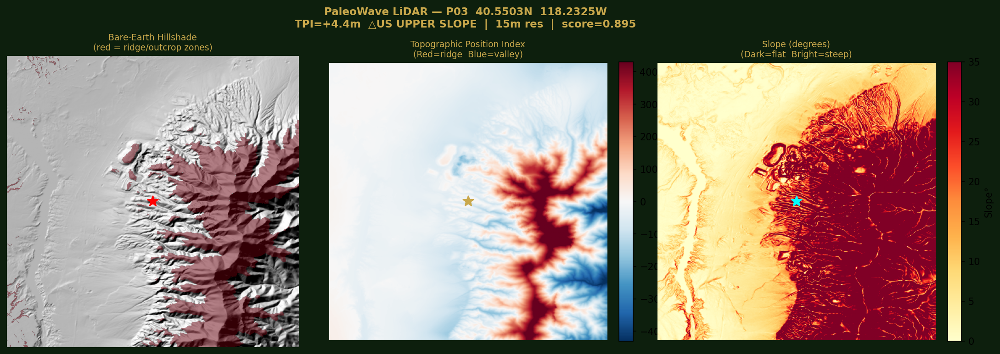

# 🌊 Project PaleoWave

<p align="center">
  
</p>

<p align="center">
  <b>Machine learning fossil locality prediction · Triassic ichthyosaurs · Central Nevada</b><br>
  <i>They ruled the Triassic seas. We're using terrain data and a Random Forest to find where they're buried.</i>
</p>

<p align="center">
  
  
  
  
  
</p>

---

## The Setup

Two hundred and forty million years ago, Nevada was the bottom of a warm shallow sea. Giant marine reptiles — ichthyosaurs up to 15 meters long — cruised these waters, hunted, died, and sank into the carbonate mud. Then a continent happened. Basin and Range tectonics folded and faulted the seafloor into the desert mountain ranges we drive past on I-80. Erosion has been working on those limestone layers ever since, slowly uncovering the bones.

Berlin-Ichthyosaur State Park found some of them. The Paleobiology Database records 30 confirmed localities across four formations. But the Triassic marine formation (TRc) covers hundreds of square kilometers of central Nevada outback — sun-hammered, roadless, and largely unwalked by paleontologists.

**PaleoWave asks: where else should we be looking?**

We trained a Random Forest on the terrain signature of every known locality — elevation, slope, aspect, ruggedness, and topographic position — and used it to score every candidate pixel within the TRc formation extent. Three phases in, we have 50 priority targets, a field report, a most-wanted list, and 20 LiDAR terrain analyses of the top candidates.

---

## The Model

### What it does

Ichthyosaur fossils don't turn up at random. They appear where Triassic limestone is being actively exhumed — basin floors and lower slopes where erosion strips overburden and exposes bone-bearing horizons. The terrain signal is real and learnable. Known sites cluster at specific elevation bands, on moderate slopes, in rugged dissected terrain, and disproportionately in **topographic basins** (negative TPI). We teach a Random Forest that signature, then ask it to find it everywhere else in the formation.

### v3 — Formation-Stratified with TPI as Direct Feature

Version 3 is the most significant model change since v1. Two upgrades:

**1. Two submodels.** The Prida and Favret formations (north, ≥39.5°N) are geologically and geographically distinct from Luning and Gabbs (south, <39.5°N). Previous versions trained a single model across both domains — which worked for the north but predicted zero of six Luning localities correctly. v3 trains separate Random Forests for each domain. The south model's LOO recall jumps from 0% to 71.4%.

**2. TPI as a direct feature.** In v2, Topographic Position Index was a hand-crafted post-hoc rule: +0.10 if TPI < −10m, −0.05 if TPI > +3m, and so on. In v3, TPI is column five of the feature matrix. The model learns the basin/ridge relationship from training data. Candidates that were *only* high because of the manual rule get exposed and demoted. Candidates with genuine multi-feature basin signal get promoted — including one (v3#2) that didn't even make the v2 top-50.

```
Features v3:  elevation_m · slope_deg · aspect_deg · tri · tpi
RF params:    n=500 trees · max_depth=6 · balanced class weights · seed=42
```

| Submodel | Domain | Training pts | LOO Recall | vs. v2 |
|----------|--------|-------------|------------|--------|
| North RF | Prida + Favret (≥39.5°N) | 23 | **65.2%** (15/23) | +2.7pp |
| South RF | Luning + Gabbs (<39.5°N) | 7 | **71.4%** (5/7) | +71.4pp |
| South SVM | tested, rejected | 7 | 0.0% | — |

---

## The Maps

### Terrain Analysis — What the Model Sees

<p align="center">
  
</p>

*Three-panel terrain analysis across the TRc study area. Left: elevation — the Basin and Range landscape sits in a tight 1,200–2,400m band where Triassic carbonates outcrop. Center: slope — jagged red ridgelines flanking open valley floors. Right: TRI ruggedness — the single strongest predictor at ~45% feature importance. Cyan dots mark known PBDB localities. The model has learned to find terrain that looks like this.*

---

### Feature Importances

<p align="center">
  
</p>

*Random Forest feature importances. TRI dominates — dissected limestone terrain is the primary separator between ichthyosaur sites and background. Slope and elevation carry the next largest signals. In v3, TPI joins as a learned feature at ~10% importance, replacing the hand-coded post-hoc rule.*

---

### LOO Validation Results

<p align="center">
  
</p>

*Leave-one-out cross-validation. Each point is one held-out locality: correct if model score ≥ 0.5. North model correctly predicts 15 of 23. All seven literature-verified localities (LIT-001 through LIT-007) predicted correctly. Misses concentrate in NaN-formation-inferred records with less reliable coordinates.*

---

### TPI Distribution — The Basin Signal

<p align="center">
  
</p>

*Topographic Position Index at all 30 training localities. The signal is unambiguous: known ichthyosaur sites skew hard toward negative TPI — basin floors and valley bottoms. This is the geological model in action: fossils are exposed by basin exhumation, not ridge erosion. In v3 the Random Forest learns this directly rather than being told about it via a rule.*

---

### v1 → v2 Ranking Changes

<p align="center">
  
</p>

*How rankings shifted as the model evolved. Big movers tell the story: candidates that climbed were in genuine basin terrain and got rewarded when TPI was introduced; candidates that fell were inflated by high RF probability alone without the depositional environment signal. v3 continues this trend — the post-hoc rule is gone and the underlying pattern holds.*

---

## LiDAR Terrain Analysis

LiDAR-derived DTMs at 15m resolution give a surgical look at each candidate's actual topographic context. Three panels per target: bare-earth hillshade (red = ridge/outcrop zones), TPI map (red = ridge, blue = valley), and slope. Twenty candidates analyzed and archived in `outputs/`.

**The key diagnostic:** does the candidate sit in a valley floor or on a ridgeline? Ichthyosaurs sink. Their bones end up in basins. A high-scoring candidate on a ridge crest is picking up formation proximity and ruggedness signal — but without the burial environment context that actually matters. LiDAR is the ground truth check on everything the model predicts.

---

### P01 — 40.4047N 118.2439W

<p align="center">
  
</p>

*v1's top candidate. TPI = +130.1m — sitting squarely on a ridge crest (deep red in the TPI panel, red-shaded zone in the hillshade). The RF loves the ruggedness and slope here, but the basin context that drives fossil exposure is completely absent. Demoted v1#1 → v2#15 → v3#3 LOW. The most instructive false positive in the dataset: this is exactly why TPI as a direct feature matters.*

---

### P02 — 40.2092N 117.5878W

<p align="center">
  
</p>

*TPI = +105.1m, pure ridge terrain. Same story as P01. Strong RF score, wrong landform. Demoted v1#2 → v2#9. In v3, too close to a known locality (4.3km) to represent a novel find regardless of terrain.*

---

### P03 — 40.5503N 118.2325W

<p align="center">
  
</p>

*TPI = +4.4m, upper slope. Not a ridge crest, but not a basin floor either. The least-bad of the original three LiDAR targets. Holds a reasonable v3 score (0.608) driven by non-TPI features. Worth a windshield survey before committing field time.*

---

### P04–P20 — Full LiDAR Archive

The remaining 17 analyses are in `outputs/lidar_P04.png` through `lidar_P20.png`. Each follows the same three-panel format. Coordinates and priority assessments for all 20 are in the field report: `outputs/PaleoWave_Field_Report_v3.pdf`.

---

## v3 Priority Targets

### The ghost and the demotion

**v3#2 (40.907N, 118.464W) — the ghost.** This point did not appear in the v2 top-50 at all. The v2 TPI post-hoc rule gave it a neutral score (TPI ≈ +0.9m at 90m resolution — not enough to trigger a bonus), and the base RF score alone didn't break the cutoff. The v3 model, with TPI as a direct feature and trained specifically on the north domain, scores it **second overall** — driven by elevation, slope, and TRI signal in concert. At 50.2km from the nearest known locality, it's the most geographically novel prediction in the dataset. This is exactly the kind of candidate a post-hoc rule will always miss.

**v3#7 (40.787N, 117.456W) — the demotion.** This was v2 #1. The headline target, 0.853 RF score, deepest basin TPI in the top-10. In v3 it's #7 with a 0.521. What happened? The v2 composite formula stacked RF probability + geo bonus + TPI adjustment, and that candidate happened to score well on all three simultaneously. In v3, the RF re-evaluates it with TPI as a feature and finds it less exceptional than the formula made it look. Still viable at 60.3km from any known locality — just no longer the lead.

### Top 10

| Rank | Lat °N | Lon °W | Score | TPI m | Nearest km | Priority |
|------|--------|--------|-------|-------|------------|----------|
| #1 | 40.265 | 117.480 | 0.689 | −2.8 | 13.8 | ⭐ HIGH |
| #2 | 40.907 | 118.464 | 0.660 | −2.1 | 50.2 | ⭐ HIGH — most novel |
| #3 | 40.405 | 118.244 | 0.608 | +18.2 | 9.1 | LOW — ridge terrain |
| #4 | 40.096 | 117.246 | 0.595 | +3.9 | 25.4 | MED |
| #5 | 40.406 | 117.706 | 0.553 | +0.9 | 21.0 | MED |
| #6 | 39.886 | 118.923 | 0.538 | +2.0 | 59.8 | MED |
| #7 | 40.787 | 117.456 | 0.521 | −0.0 | 60.3 | MED — was v2 #1 |
| #8 | 40.209 | 117.588 | 0.517 | −1.0 | 4.3 | SKIP — too close |
| #9 | 40.401 | 117.208 | 0.515 | +1.0 | 41.0 | MED |
| #10 | 39.655 | 117.859 | 0.504 | −3.1 | — | ⭐ HIGH — strongest basin |

> ⭐ **Three HIGH targets: v3#2, v3#1, v3#10.** All three combine basin TPI, genuine distance from known localities, and consistent multi-feature RF signal. Start here.
>
> Full 50-target list with all fields: `data/model/paleowave_v3_top50.csv` — load into Gaia GPS, Avenza Maps, or Google Earth.

---

## Data Sources

| Source | What | How |
|--------|------|-----|
| [PBDB](https://paleobiodb.org) | 30 ichthyosauria records, Nevada, Triassic | API harvest (nb 01) |
| USGS 3DEP 1/9″ (~8m) | 6 DEM tiles → `dem_merged.tif` (2.7GB) | TNM download (nb 05) |
| NBMG geology | TRc formation polygon | State geology layer |
| USGS 3DEP LiDAR | 20 × 15m DTM tiles at priority targets | TNM API (nb 05) |
| Literature | 7 localities, Merriam 1908 → Klein 2020 | Manual harvest (nb 09) |
| iDigBio / CMC | 15 *Cymbospondylus* records — exact coords pending | API harvest (nb 08) |

---

## Repository Structure

```
Project-PaleoWave/
├── assets/
│   ├── paleowave_flag.png
│   ├── paleowave_banner.png
│   ├── Project_Paleo_banner_v2.png
│   └── terrain_overview.png
├── notebooks/
│   ├── 01_pbdb_harvest.ipynb
│   ├── 02_background_sampling.ipynb
│   ├── 03_terrain_features.ipynb
│   ├── 04_model_v1.ipynb
│   ├── 05_lidar_tpi.ipynb
│   ├── 06_model_v2_tpi.ipynb
│   ├── 07_loo_validation.ipynb
│   ├── 08_idigbio_harvest.ipynb
│   ├── 09_literature_harvest.ipynb
│   └── 10_model_v3_stratified.ipynb    ← Phase 3
├── data/
│   ├── pbdb/
│   │   ├── pbdb_occurrences_clean.csv
│   │   └── paleowave_background_proper.csv
│   ├── dem/
│   │   └── dem_merged.tif              (2.7GB — add to .gitignore)
│   ├── terrain/
│   │   ├── elevation_v3.tif            (re-derived at 90m, BigTIFF)
│   │   ├── slope_v3.tif
│   │   ├── aspect_v3.tif
│   │   ├── tri_v3.tif
│   │   └── tpi_v3.tif                  (new in v3)
│   └── model/
│       ├── paleowave_rf_v3_north.joblib
│       ├── paleowave_rf_v3_south.joblib
│       ├── paleowave_v3_top50.csv
│       ├── paleowave_v3_loo_results.csv
│       └── paleowave_v3_training_features.csv
└── outputs/
    ├── PaleoWave_Field_Report_v3.pdf
    ├── lidar_P01.png  …  lidar_P20.png
    ├── feature_importance_v2.png
    ├── loo_validation_paleowave.png
    ├── tpi_distribution_paleowave.png
    ├── rank_change_v1_v2.png
    ├── paleowave_targets.gpx
    └── paleowave_targets.kmz
```

---

## Known Localities

Thirty PBDB records across four formations, supplemented by seven literature localities cross-checked during Phase 2. All seven were already in PBDB — zero net new records, but independent georeferencing validation. One formation fix applied: `occ:1186493` (*C. nevadanus*, New Pass, Lander Co.) had a null formation field, corrected to Prida from Merriam 1908.

| Formation | n | Key taxa | Domain |
|-----------|---|----------|--------|
| Prida | 10 | *Cymbospondylus* | North |
| Favret | 7 | *Cymbospondylus*, *Augustasaurus*, *Thalattoarchon* | North |
| Luning | 6 | *Shonisaurus popularis* | South |
| Gabbs | 1 | *Shonisaurus* | South |
| NaN → inferred | 6 | mixed | mixed |

**Pending:** Cincinnati Museum Center (CMC) holds 15 *Cymbospondylus* specimens from the Favret Formation (VP6396–VP13158). Coordinates in iDigBio are formation centroids only. Email sent to C. Schwalbach (Collections Manager) and Dr. G. Storrs (Curator, Vertebrate Paleontology) requesting precise locality data. Model will retrain when received.

**Also pending:** FMNH locality data for PR2251 (*C. nichollsi*) and PR3032 (*Thalattoarchon saurophagis*) — exact coordinates on file at the Field Museum per Klein 2020 and Frobisch 2013.

---

## Phase History

| Phase | Key deliverable | Status |
|-------|----------------|--------|
| 1 | v1 RF, AUC 0.906, top-50 candidates, 4 terrain features | ✅ Complete |
| 2 | LiDAR TPI analysis (20 targets), v2 composite score, LOO validation, iDigBio + literature sweep | ✅ Complete |
| **3** | **Formation-stratified v3 · TPI direct feature · north 65.2% / south 71.4% LOO · terrain re-derived at 90m** | ✅ **Complete** |
| 4 | Full TRc raster scan with v3 models | ⏳ Planned |
| 4 | Retrain with CMC exact localities | ⏳ Waiting on CMC |
| 4 | FMNH locality request (PR2251, PR3032) | ⏳ Not yet sent |

---

## The Geology in One Paragraph

The Middle Triassic Prida Formation and its lateral equivalents — Favret, Luning, Gabbs — were deposited on a carbonate ramp on the western margin of Pangea. Water depths ranged from shallow platform to several hundred meters in the basinal facies. Ichthyosaurs are found in the deeper-water carbonate mudstone: dark micritic limestone with occasional concentrated bone horizons, interpreted as mass strandings or carcass-fall accumulation. The Nevada finds are globally significant. *Shonisaurus popularis* at Berlin-Ichthyosaur is the largest known Triassic ichthyosaur. *Thalattoarchon saurophagis* from the Favret Formation is one of the earliest macropredatory apex predators of the Mesozoic — the ichthyosaur that ate other ichthyosaurs. Erosion rates in the Basin and Range are high enough that new exposures are geologically continuous. They just need someone to walk to them.

---

## Field Use

Any vertebrate fossil collection on federal land requires a PRPA permit. Any finds should be reported to the relevant BLM field office and submitted to PBDB. This project predicts where to look — it does not collect.

Load `paleowave_v3_top50.csv` into Gaia GPS, Avenza Maps, or Google Earth. Full field report with target coordinates, legal disclaimers, and safety information: `outputs/PaleoWave_Field_Report_v3.pdf`.

---

<p align="center">
  
</p>

<p align="center">
  <sub>
    Project PaleoWave · Phase 3 complete · github.com/bdgroves/Project-PaleoWave<br>
    Data: PBDB · USGS 3DEP · NBMG · iDigBio · Literature
  </sub>
</p>
