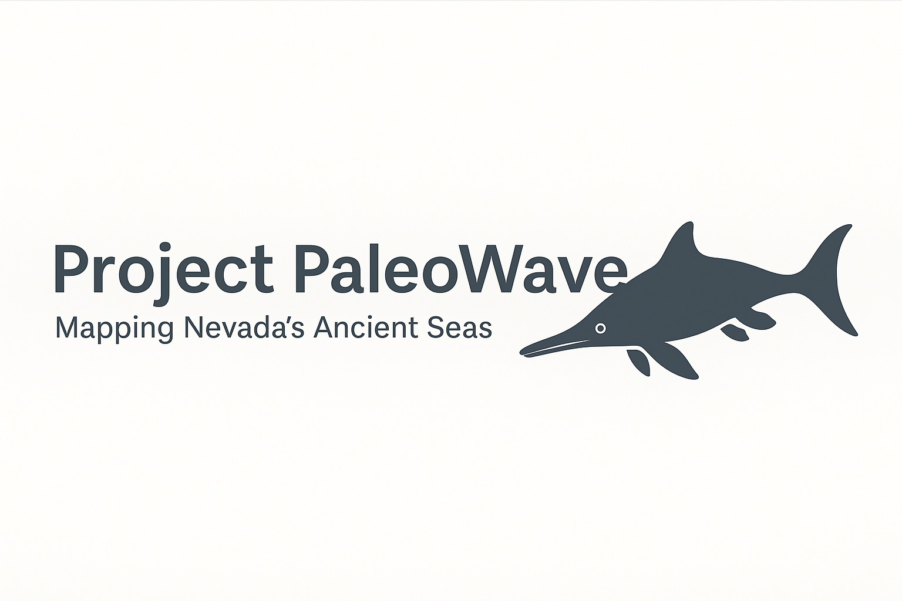
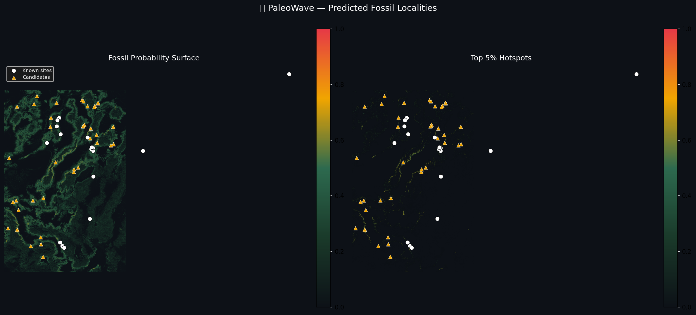
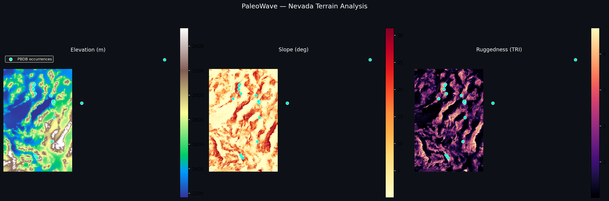
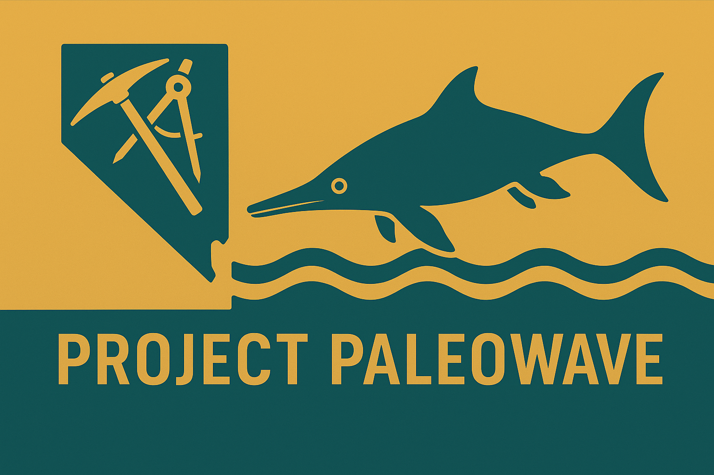
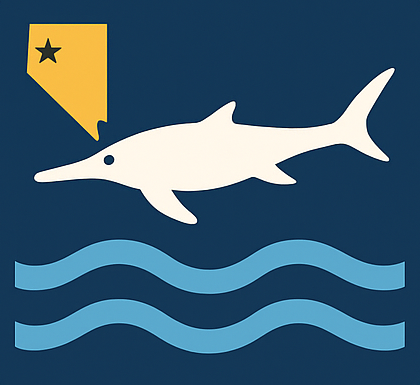

# 🦴 Project PaleoWave



[](https://www.python.org/)
[](https://prefix.dev/)
[](https://pdal.io/)
[](https://qgis.org/)
[]()
[]()

---

*They said the desert was dead. They were wrong by 200 million years.*

In the 1990s, a UNR student wandered into the Humboldt Range and found ichthyosaur bones eroding out of a limestone ridge. Decades later, Great Basin Brewing named their flagship IPA "Icky" in honor of *Ichthyosaurus* — Nevada's state fossil. Project PaleoWave asks a simple question: **where are the ones nobody's found yet?**

---

## 🎯 Mission

Use modern geospatial intelligence — terrain analysis, machine learning, and public paleontological databases — to predict undiscovered ichthyosaur fossil localities in central Nevada's Triassic marine formations.

---

## 📊 Phase 1 Results

| Metric | Value |
|--------|-------|
| Model | Random Forest (500 trees) |
| Cross-validation AUC | **0.906 ± 0.072** |
| Training positives | 27 PBDB occurrences |
| Study area | 700M+ pixels (n39-41, w117-119) |
| Top predictors | Slope (0.293), TRI (0.291) |
| Candidate sites generated | 50 ranked localities |
| Priority #1 score | 1.000 (52m from TRc formation) |

### Key Finding
Ichthyosaur fossil sites in Nevada preferentially occur at **1400–1750m elevation**, on **8–15° slopes**, with **low-moderate terrain ruggedness** — characteristic of eroding Triassic marine formation outcrops. The model achieves 0.906 AUC using terrain data alone.

### Top 5 Field Targets

| Priority | Lat | Lon | Score | Geology |
|----------|-----|-----|-------|---------|
| #1 | 40.4047°N | 118.2439°W | 1.000 | ON TRc (52m) |
| #2 | 40.2092°N | 117.5878°W | 0.895 | 992m to TRc |
| #3 | 40.5503°N | 118.2325°W | 0.895 | 1361m to TRc |
| #4 | 40.4344°N | 117.6867°W | 0.892 | 4781m to TRc |
| #5 | 40.8397°N | 117.7208°W | 0.892 | 1059m to TRc |

> **TRc** = Nevada Triassic limestone/dolomite — includes Favret, Luning, Star Peak Group, Augusta Mountain formations

---

## 🗺️ Maps

### Prediction Surface & Hotspots


### Terrain Analysis


---

## 📁 Project Structure

```
Project-PaleoWave/
├── notebooks/
│   ├── 01_pbdb_harvester.ipynb       # PBDB API → 30 Nevada occurrences
│   ├── 02_terrain_analysis.ipynb     # USGS 3DEP DEM → slope/aspect/TRI
│   └── 03_ml_model.ipynb             # Random Forest → prediction surface
├── data/
│   ├── pbdb/                         # Occurrence CSVs + GeoJSON
│   ├── dem/                          # USGS 3DEP tiles (gitignored, ~2GB)
│   ├── terrain/                      # Slope, aspect, TRI rasters
│   ├── geology/                      # Nevada Triassic marine shapefile
│   └── model/                        # Trained model + prediction outputs
├── outputs/
│   ├── PaleoWave_Field_Report.pdf    # Field-ready target report
│   ├── paleowave_targets.kmz         # Google Earth file
│   └── paleowave_targets.gpx         # Garmin GPS file
├── qgis/
│   └── paleowave.qgz                 # QGIS project with all layers styled
├── assets/                           # Project imagery
└── pixi.toml                         # Reproducible Python environment
```

---

## 🚀 Workflow

```
PBDB API          USGS 3DEP          USGS NGMDB
    |                 |                   |
    v                 v                   v
Occurrence       DEM Tiles           Nevada Triassic
  Records    ->  (6 tiles,       ->    Marine Geology
(27 Nevada)     ~10m res)            (312 polygons)
    |                 |                   |
    +--------+--------+                   |
             v                           |
      Terrain Features              Geology Cross-
   (slope, aspect, TRI,        ->   Reference +
      elevation)                    Distance Score
             |                           |
             v                           |
      Random Forest              Composite Score
      Classifier         ->      Ranking (0-1)
      AUC = 0.906                        |
             |                           v
             v                    50 Priority Field
      Probability            ->      Targets
       Surface                  (KMZ + GPX + PDF)
```

---

## Setup

```powershell
# Clone and install
git clone https://github.com/bdgroves/Project-PaleoWave.git
cd Project-PaleoWave
pixi install

# Launch JupyterLab
pixi run lab
```

Run notebooks in order: `01` then `02` then `03`

> **Note:** Notebook 02 downloads ~600MB of DEM tiles from USGS. Run cell 4 (deduplication) before cell 5 (download) to avoid downloading 20 tiles instead of 6.

---

## Key Outputs

| File | Description |
|------|-------------|
| `outputs/PaleoWave_Field_Report.pdf` | Full field report — top 10 targets, coordinates, field notes, disclaimers |
| `outputs/paleowave_targets.kmz` | All 50 targets for Google Earth |
| `outputs/paleowave_targets.gpx` | All 50 targets for Garmin/GPS |
| `data/model/priority_targets.geojson` | Ranked targets with geology cross-reference |
| `data/model/prediction_surface.tif` | Full probability raster for QGIS |
| `qgis/paleowave.qgz` | QGIS project — open and explore |

---

## ⚠️ Disclaimer

This project is a research tool. Predicted localities are NOT guaranteed to contain fossils. **Vertebrate fossil collection on federal land requires a PRPA permit** — contact BLM Winnemucca District (775-623-1500) before collecting. Verify land ownership before entering any site. See the full disclaimer in the field report PDF.

---

## Phase 2 Roadmap

- [ ] Integrate raw LiDAR data for sub-meter resolution analysis
- [ ] Add Nevada geologic formation age constraints
- [ ] Expand training data with additional PBDB taxa
- [ ] Field validation of top 10 targets
- [ ] Update model with new locality data

---

## Data Sources

- [Paleobiology Database](https://paleobiodb.org) — occurrence records
- [USGS 3DEP](https://www.usgs.gov/3d-elevation-program) — elevation data
- [USGS National Geologic Map Database](https://mrdata.usgs.gov/geology/state/) — Nevada geology
- [Berlin-Ichthyosaur State Park](https://parks.nv.gov/parks/berlin-ichthyosaur) — primary known locality

---



*Project PaleoWave — Because the desert remembers everything.*


